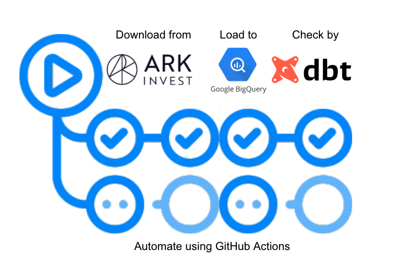
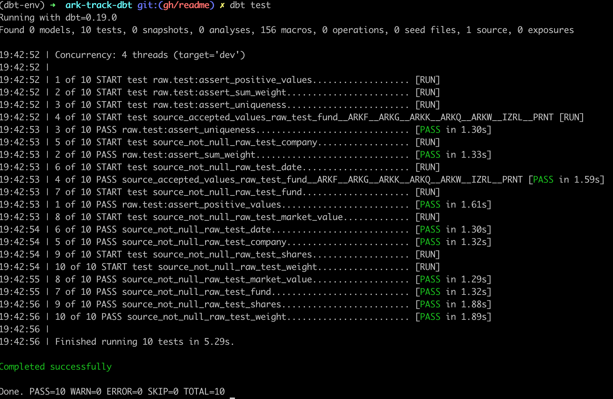
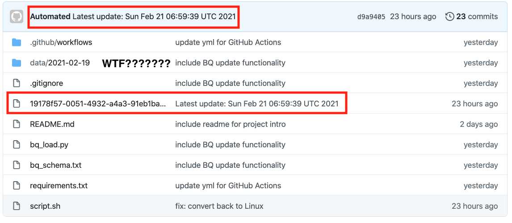
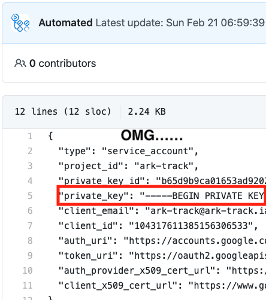

# project ARK

## :question:Purpose
This is my side project for the famous ARK funds https://ark-funds.com/ :kissing: ARK funds are transparent enough to show their holdings daily.

But I am more curious about the **CHANGES**, for example:

- which companies are included recently?
- which companies are removed recently?
- how do the weights change?
- etc etc

To see the current snapshot is easy, just go to their site! But to see the changes and have more analyses based on the current snapshot alone is more challenging. So, this project exists :grin:

Also write up a medium post for this repo:
https://medium.com/@geoffreyhung/from-curl-to-automated-workflow-d79c7c108450

## :muscle:Project plans

1. **[Extract]** Scraping script to extract and clean the snapshot from site daily using `GitHub Actions` **[DONE]**
2. **[Load]** Load data to data warehouse such as `BigQuery` **[DONE]**
3. **[Quality]** Write some data testings using `dbt` **[DONE]**
4. **[Analysis]** Have some analytic queries in `dbt` plus some visualizations maybe

##### Maybe, maybe not
5. **[Visualization]** interactive data visualization site
6. **[Subscription]** subscribe the changes and send myself a summary email

## :rainbow:High level flow
At 0030, 0830, 1630 daily,
1. GitHub Actions will be kickstarted, setup and install packages
2. The workflow will then download csv data from ARK site and store in `data` folder
3. The script will push the data to defined BigQuery table
4. The script will run `dbt test` to check data quality



##### Data extraction and cleaning
In `scripts/collect_and_load.sh`, it will get the csv data from https://ark-funds.com/wp-content/fundsiteliterature

Then we have some simple transformations:
1. remove some useless rows, eg: disclaimers in csv
2. transform the date format [Since BigQuery requires a YYYY-MM-DD for local upload]

Then it will use `scripts/bq_load.py` [being called by `scripts/collect_and_load.sh`] to upload the data to BigQuery


##### :white_check_mark: dbt test

Here we use `dbt` to do some data quality checks, eg: we try to check the uniqueness and value range. To ensure that the loaded data makes sense. Plus, `dbt test` is part of the CI workflow [ie: everything after we load the data to BigQuery, it will run and check]

To use dbt test, in terminal:
```
cd ark-track-dbt # We need to be in the same level as dbt_project.yml
dbt test
```

:exclamation::exclamation::exclamation: But you cannot fork and run because you don't have my credentials to access my BigQuery, to learn more about dbt, https://docs.getdbt.com/tutorial/setting-up/

Below is the capscreen



## :construction:Code structure
```
project-ark
├── README.md               # we are here~
├── ark-track-dbt           # store dbt project
│   ├── README.md
│   ├── analysis
│   ├── data
│   ├── dbt_modules
│   ├── dbt_project.yml     # define project and which profile to use
│   ├── macros
│   ├── models
│   │   └── source.yml      # define source data and schema test
│   ├── profiles.yml        # define BigQuery data source setting
│   ├── snapshots
│   └── tests               # contain tests for data quality check
├── data                    # contain processed data
│   ├── 2021-02-19
│   │   ├── ARKF.csv
│   │   ├── ...
│   └── tmp
├── misc
│   └── bq_schema.txt       # Table schema in BigQuery
├── requirements.txt        # Required Python Package for GitHub Actions
├── scripts
│   ├── bq_load.py          # script to load csv to BigQuery
│   └── collect_and_load.sh # script to download & process & load data
│── .github/workflows       # GitHub Action script
```


## :books:Lessons learned

#### Secrets are exposed by GitHub Actions!?!? <-spoiler: don't panic, it is my problem
When I tried to use GitHub Actions to push the data to GCP BigQuery, one accident made me super panic! My Google Service Account json was committed to my repo despite I stored it in my GitHub Secrets! I literally shared all the credentials to everyone who can read the repo!:scream: WTF is going on!?!? 

:exclamation::exclamation::exclamation: ***Don't attempt to check my commits, I have disabled the old key already***:exclamation::exclamation::exclamation: 



1. My first guess was I copied the plain JSON to GitHub Secrets and somehow it leaks during the progress?🤔

2. Hmmm I rmb people said the key should be base64, ok, let me try it by using `cat key.json | base64`, and then copy that to GitHub Secrets. But GitHub Actions still created a commit to show all my secrets........:weary:

3. I notice the secret file name is similar to hash [no meaning, random strings] and secrets are pushed by GitHub Actions, that is responsible for pushing the new data to my repo! Somehow other than data, it finds a file that contains my secrets???🤔

4. At last, my solution is: change `git add -A` to `git add data` 🧠  My guess is, GitHub Actions somehow create a file for secrets access, normally we will not know the file name because it is randomly generated. BUT they may not expect some people have a step to git push all the files, including the secrets!!!


5. The reason why I used `git add -A` is, I literally copied it from other repo, it is nice for their cases because they don't use Google Cloud and need to handle the credentials, a big lesson is that we should be specific about everything, don't apply actions to ALL without really knowing all the consequences! :neutral_face:

BTW, to decode base64, simply run: `cat encoded_secret | base64 -d`

#### GitHub Actions as scheduler

In the future, for the regular simple tasks, eg: scrape something. Instead of setting up cron job in my computer, I may simply use GitHub Actions directly. It is quite challenging to use up the free quota

reference: https://docs.github.com/en/github/setting-up-and-managing-billing-and-payments-on-github/about-billing-for-github-actions

#### Bash command is important, period
For simple data transformation [remove some rows, replace some strings], it seems having another Python script is overkill, many terminal commands are quite helpful

- awk
- cut
- rev
- .......

## Thank you section, materials that help a lot during development

- stackoverflow-oriented programming
https://stackoverflow.com/

- GitHub Actions & scraper template from here, but it only keeps the latest data, that's why I make this one to store the daily snapshots
https://github.com/tigger0jk/ark-invest-scraper

- Emoji list, help me to write this readme
https://gist.github.com/rxaviers/7360908

- Code snippet to use dbt in GitHub Actions
https://gist.github.com/troyharvey/d61ebe704395c925bf9448183e99af3e

- Document to setup Google credential in GitHub Actions
https://github.com/google-github-actions/setup-gcloud

- Document to setup loading data to BigQuery
https://cloud.google.com/bigquery/docs/batch-loading-data
